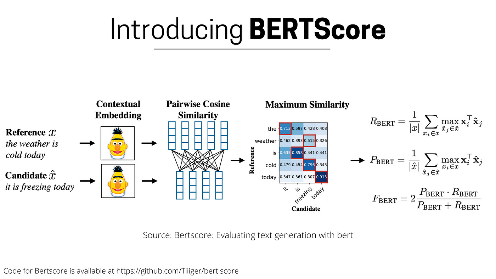

#NLP #LLM #DNN 
# Intro 

https://colab.research.google.com/drive/1WC6M0f1ycusNmAPUIwiMZN27reMmOF2O?usp=sharing

transcript speech to text using whisper model and 

### OpenAI’s Whisper

**


https://docs.google.com/presentation/d/1O0j4Pz1Ef8rHzrptKRlR5M5Lu9tomUqtJYrH7ZtHxHc/edit?usp=sharing

phi-3 model : 
https://huggingface.co/microsoft/Phi-3-mini-4k-instruct


instruct : models that always predict the next token 


prompt formmatting : 


better use :

```python 

    "Consider the following text:\n"
    "\n"
    f"{transcription}\n"
    "\n"
    "Please provide me a summary of that text."


```

## Evaluation

consider the following assigemt of a student , 


please first provide a thorough analysis of the students summary and then grade it according to german grade system 1 to 6 


In context learning


representation learning 
