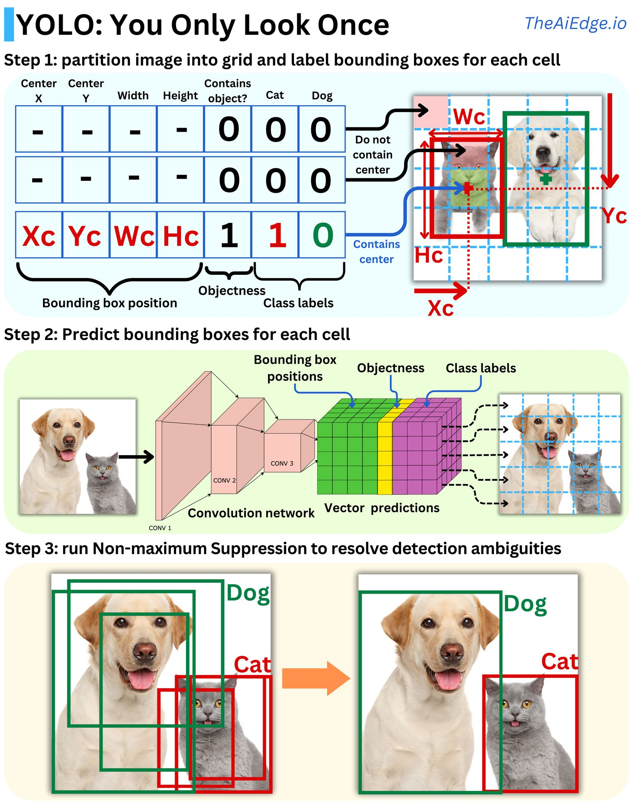

#CV #DNN #machinelearning 

YOLO really changed the game when it comes to object detection! Back in the day, we had to use the sliding window method at different scales and apply an image classifier. The method was imprecise and very slow, and it was not really possible to run it in real-time on videos, for example. YOLO (You Only Look Once) changed everything by predicting everything at once, making it possible to run it in real-time while being small enough to fit in a mobile application.

The first YOLO model came out in 2015, and YOLO v9 came out last week. There have been many improvements over the years, but there are common features that persist. The idea is to segment the image into a grid and predict the existence of a bounding box for each of the classes we are considering. When it comes to labeling the data, a grid cell is labeled to contain an object only if the center of the box is in it. If the grid cell contains a center, the "objectness" is labeled 1 and 0 otherwise. The model will try to predict the probability that a grid cell contains a center. If it contains a center or multiple ones, each class related to those centers will be labeled with 1s. If we have 2 classes (e.g., cat and dog), the label vector will be [1, 1, 0] if the grid cell contains a cat, [1, 1, 1] if the grid cell contains a cat and a dog, and [0, 0, 0] if it contains nothing. Added to that, the label vector holds as well the (x, y) coordinates of the box centers for each class and their sizes (w, h): [x, y, w, h, x', y', w', h', 1, 1, 0]. The full target to predict is the set of label vectors for each grid cell. The full target includes multiple box priors, expanding the target dimensionality. Those priors are anchor boxes that guide the model with a set of typical box shapes seen in the data. For example, V2 uses 5 different priors with a grid of 13 x 13, making the target a tensor of 13 x 13 x 11 x 5 = 9295 parameters.

The model is a simple convolutional network with the output of the last conv layer having the dimensionality of the target. This means that for each cell, the model will predict if there is an object, the probability for each class, and the dimensions and positions of the resulting bounding boxes for each prior.

Because the model will likely predict multiple bounding boxes for the same object, it is necessary to select the best ones. The idea is to choose the box with the highest confidence score, measure its intersection area over union area (IOU) with all the other overlapping boxes of the same class, and remove all that are above a certain threshold. This is called non-maximum suppression. This ensures that boxes with high overlaps are merged into one.

Here is the paper for YOLO v1: [https://arxiv.org/pdf/1506.02640](https://arxiv.org/pdf/1506.02640?fbclid=IwZXh0bgNhZW0CMTAAAR3lyKzlXy0R8GoHVNwQ1bFwXCT6afi0mRrAfcrutL-A_1tCbj3yPIeCBTA_aem_DdO5F7lFltnbzMRLfxSu0g), and here for YOLO v9: [https://arxiv.org/pdf/2402.13616](https://arxiv.org/pdf/2402.13616?fbclid=IwZXh0bgNhZW0CMTAAAR3x2qpZmmvKHwIOmoQrAiX5HjmcmrK9nw3qHPF_zZ9u7l6ww8U_y3Iv-gw_aem_3jSs1u2NRoW-NoTbM9Oalg).

