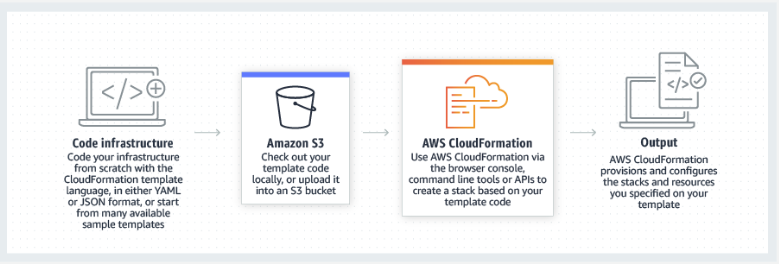

* CloudFormation helps **you model and set up your AWS resources** so that you can spend less time managing resources and more time focusing on your applications. 

* Using CloudFormation, you create a template that describes all the AWS resources that you want (like Amazon EC2 instances or Amazon RDS DB instances).

 * Once you create the template, CloudFormation takes care of provisioning and configuring those resources for you. 

* You don't need to individually create and configure AWS resources and figure out what's dependent on what; CloudFormation handles that.

 * CloudFormation can help you simplify infrastructure management, quickly replicate your infrastructure, and easily control and track changes to your infrastructure.

# Stack 

-   A stack is a collection of AWS resources that you can manage as a single unit. 

-   In other words, you can create, update, or delete a collection of resources by creating, updating, or deleting stacks.

-    All the resources in a stack are defined by ***the stack's AWS CloudFormation template***. 

-   A stack, for instance, can include all the resources required to run a web application, such as a web server, a database, and networking rules. If you no longer require that web application, you can simply delete the stack, and all of its related resources are deleted.

-   **AWS CloudFormation** ensures all stack resources are created or deleted as appropriate. Because AWS CloudFormation treats the stack resources as a single unit, they must all be created or deleted successfully for the stack to be created or deleted. If a resource can't be created, AWS CloudFormation rolls the stack back and automatically deletes any resources that were created. If a resource can't be deleted, any remaining resources are retained until the stack can be successfully deleted.

