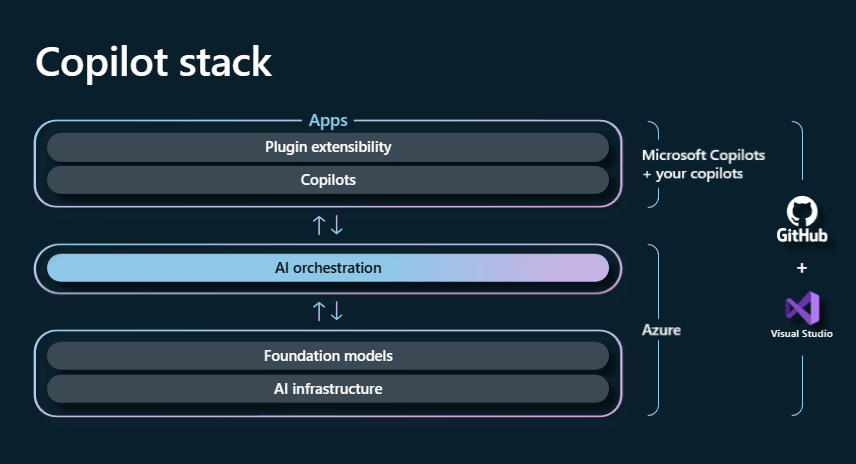

#GenAI

This module introduced you to the concept of copilots and how Azure Copilot Stack applies OpenAI generative AI models to easily build a customized copilot for your startup.

In this module, you also learned:

- The basic features and benefits of Azure OpenAI, Microsoft GitHub Copilot, Microsoft 365 Copilot, and Azure Copilot Stack.
- The best practices associated with building a copilot for your startup.
