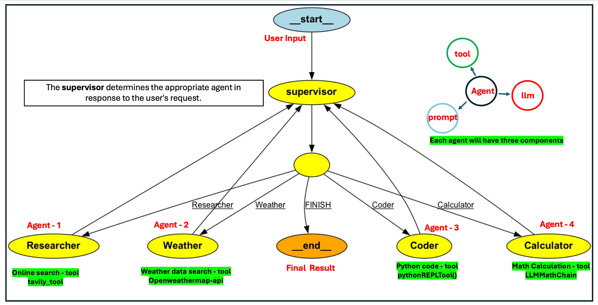

#GenAI 
## ReAct prompt Engineering

# LangGraph 

https://langchain-ai.github.io/langgraph/concepts/#data-flow-of-a-single-execution-of-a-stategraph

https://github.com/langchain-ai/langgraph/tree/main/examples

Nodes
States 
Edges

## Agentic search 
