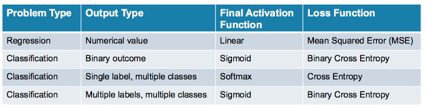

## Classification 

In categorical cross entropy :

-   if it is `prediction` it will compute the `cross entropy` directly
-   if it is `logit` it will apply `softmax_cross entropy with logit`

In Binary cross entropy:

-   if it is `prediction` it will convert it back to `logit` then apply `sigmoied cross entropy with logit`
-   if it is `logit` it will apply `sigmoied cross entropy with logit`directly