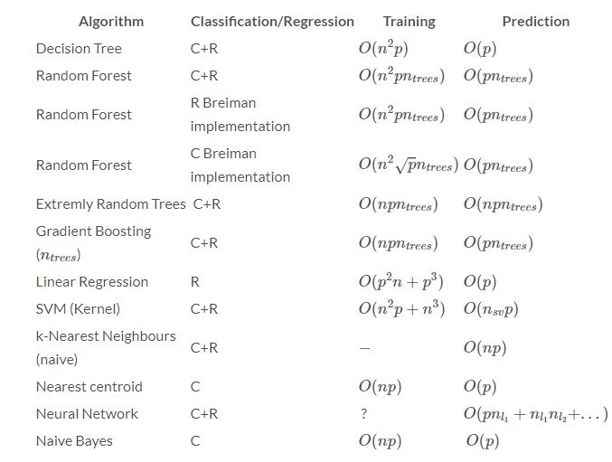
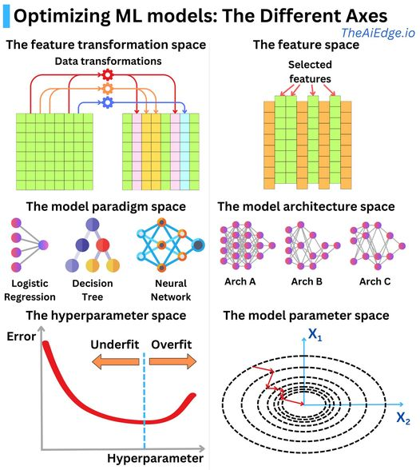

#machinelearning 

# Overview

## How to start 

# Fine Tuning

References : 
* [tuning playbook](https://github.com/google-research/tuning_playbook)
* [Interpretability vs Explainability: The Black Box of Machine Learning](https://www.bmc.com/blogs/machine-learning-interpretability-vs-explainability/#:~:text=Interpretability%20has%20to%20do%20with,Nets%2C%20to%20justify%20the%20results.)
##  Explainability Vs. interpretability

# ML Algorithms and Complexity

# Optimizing ML models 

