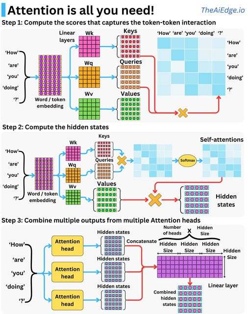
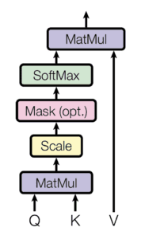
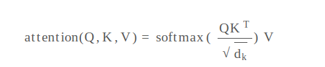
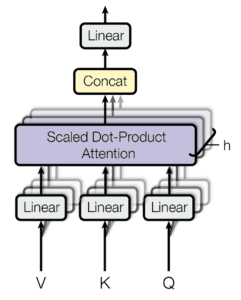
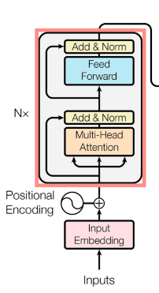
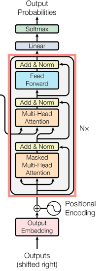
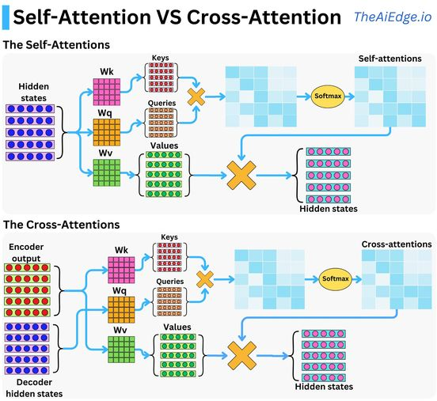

#DNN #deeplearning 

sources:
* [The Transformer Model](https://machinelearningmastery.com/the-transformer-model/?fbclid=IwAR0IQKCtCr6A7qKie70bUmwRyH71BWWZL6AHYf6rVErVtLK4T4flmdE42jk)
* https://huggingface.co/docs/transformers/index
- [The concept of attention](https://machinelearningmastery.com/what-is-attention/)
- [What is attention](https://machinelearningmastery.com/what-is-attention/)
- [The Attention Mechanism from Scratch](https://machinelearningmastery.com/the-attention-mechanism-from-scratch/)

## Attention

is the ability **to dynamically highlight and use the _salient_ parts of the information at hand**—in a similar manner as it does in the human brain—that makes attention such an attractive concept in machine learning.

Think of an attention-based system consisting of three components:

> 1.  _A process that “reads” raw data (such as source words in a source sentence), and converts them into distributed representations, with one feature vector associated with each word position._ 
> 
> 2.  _A list of feature vectors storing the output of the reader. This can be understood as a “memory” containing a sequence of facts, which can be retrieved later, not necessarily in the same order, without having to visit all of them._
> 
> 3.  _A process that “exploits” the content of the memory to sequentially perform a task, at each time step having the ability put attention on the content of one memory element (or a few, with a different weight)._
> 
> – Page 491, [Deep Learning](https://www.amazon.com/Deep-Learning-Adaptive-Computation-Machine/dp/0262035618/ref=sr_1_1?dchild=1&keywords=deep+learning&qid=1622968138&sr=8-1), 2017.

✨Encoder-Decoder framework is an example of an attention mechanism.

## Attention mechanism

The attention mechanism was introduced to **improve the performance of the encoder-decoder** model for machine translation.

💫The idea behind the attention mechanism was to permit the decoder to utilize **the most relevant parts of the input sequence** in a flexible manner, by a weighted combination of all the encoded input vectors, with the most relevant vectors being attributed the highest weights.

## The Concept of attention

The main components used by the Transformer attention are the following:

-   q and k denoting vectors of dimension, $d_k$, containing the **queries and keys**, respectively
-   v denoting a vector of dimension, $d_v$, containing the values
-   Q, K, and V denoting matrices packing together sets of queries, keys, and values, respectively.
-   $W^Q$, $W^K$ and $W^V$ denoting projection matrices that are used in generating different subspace representations of the query, key, and value matrices
-   $W^O$ denoting a projection matrix for the multi-head output

### Scaled dot-product attention

The scaled dot-product attention first computes a _dot product_ for each query, $q$, with all of the keys, $k$. It subsequently divides each result by $\sqrt{d_k}$ and proceeds to apply a softmax function. In doing so, it obtains the weights that are used to _scale_ the values, $v$.

The matrices—Q, K, and V—are supplied as inputs to the attention function:

### Multi-Head Attention

Multi-head attention mechanism linearly projects the **queries, keys, and values** $h$ times, using a different *learned projection* each time. The single attention mechanism is then applied to each of these h projections in parallel to produce h outputs, which, in turn, are concatenated and projected again to produce a final result.

🔥The idea behind multi-head attention is to allow **the attention function to extract information from different representation subspaces**, which would otherwise be impossible with a single attention head.

## Architecture

  

The Transformer architecture follows an **encoder-decoder** structure. but does not rely on **recurrence and convolutions** in order to generate an output.

#### ENCODER: 
maps an input sequence to a sequence of continuous representations.

The encoder consists of a **stack** of N = 6 identical layers, where each layer is composed of two sublayers:

1.  The first sublayer implements a [**multi-head self-attention mechanism**](### Multi-Head Attention).  that the multi-head mechanism implements h heads that receive a (different) linearly projected version of the queries, keys, and values, each to produce h outputs in parallel that are then used to generate a final result. 
	1. The six layers of the Transformer encoder apply the same linear transformations to all the words in the input sequence, but _each_ layer employs **different** weight (W1,W2) and bias (b1,b2) parameters to do so.
	2. each of these two sublayers has a **residual connection** around it.
	3. Each sublayer is also succeeded by a **normalization layer**.
	4. the Transformer architecture cannot inherently capture any information about the relative positions of the words in the sequence since it does not make use of recurrence. **This information has to be injected by introducing _positional encodings_ to the input embeddings.**
		1. The **positional encoding vector**s are of the same dimension as the input embeddings and are generated *using sine and cosine functions of different frequencies*. Then, they are simply summed to the input embeddings in order to _inject_ the positional information.
2.  The second sublayer is a fully connected feed-forward network consisting of two linear transformations with Rectified Linear Unit (ReLU) activation in between:

#### DECODER:
receives the output of the encoder together with the decoder output at the previous time step to generate an output sequence.

The decoder also consists of a stack of N = 6 identical layers that are each composed of three sublayers:
1.  The first sublayer receives the **previous output of the decoder stack**, augments it with positional information, and implements **multi-head self-attention** over it. While the encoder is designed to attend to all words in the input sequence _regardless_ of their position in the sequence, the decoder is modified to attend _only_ to the preceding words. Hence, the prediction for a word at position i can only depend on the known outputs for the words that come before it in the sequence. In the multi-head attention mechanism (which implements multiple, single attention functions in parallel), this is achieved by introducing a **mask over the values produced by the scaled multiplication of matrices Q and K.** 

2.  The second layer implements a **multi-head self-attention mechanism** similar to the one implemented in the first sublayer of the encoder. On the decoder side, this multi-head mechanism receives the queries from the previous decoder sublayer and the keys and values from the output of the encoder. This allows the decoder to attend to all the words in the input sequence.

3.  The third layer implements a **fully connected feed-forward network**, similar to the one implemented in the second sublayer of the encoder.

Furthermore, the three sublayers on the decoder side also have residual connections around them and are succeeded by a normalization layer.

Positional encodings are also added to the input embeddings of the decoder in the same manner as previously explained for the encoder.

# Self-Attention vs Cross-Attention

