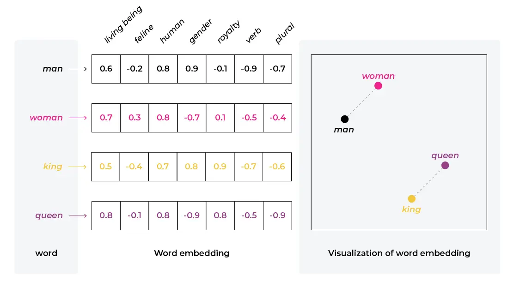
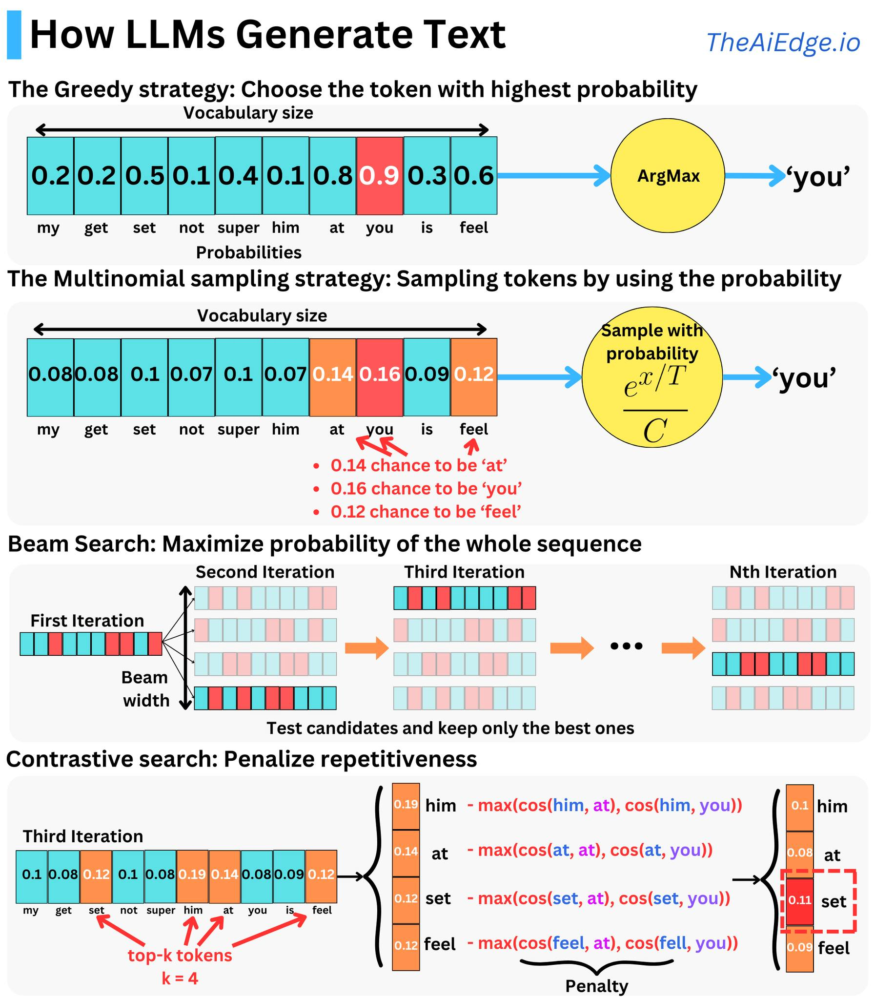

#datascience #LLM 

Embeddings are foundational because:

1. They provide a common mathematical representation of your data
2. They compress your data
3. They preserve relationships within your data
4. They are the output of deep learning layers providing comprehensible linear views into complex non-linear relationships learned by models

# BERT Tokenizer 

# Generating Text 
#LLM 

