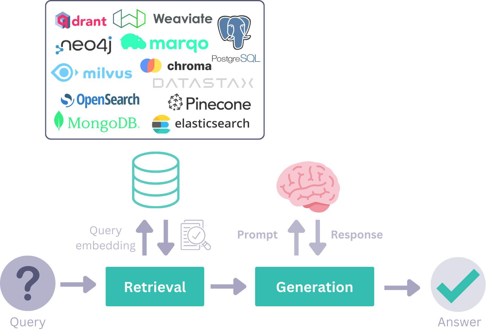

Course :  [Building AI Applications With Haystack - DeepLearning.AI](https://learn.deeplearning.ai/courses/building-ai-applications-with-haystack/lesson/2/haystack-building-blocks)

Refs : 

* [What is Haystack? | Haystack (deepset.ai)](https://haystack.deepset.ai/overview/intro)
* 
# Building Blocks 

## Components
At the core of Haystack are its [components](https://docs.haystack.deepset.ai/docs/components_overview#components) building blocks that can perform tasks like [document retrieval](https://docs.haystack.deepset.ai/docs/retrievers), [text generation](https://docs.haystack.deepset.ai/docs/generators), or [creating embeddings](https://docs.haystack.deepset.ai/docs/embedders). A single component is already quite powerful. It can manage local language models or communicate with a hosted model through an API.

### Retrievers
Retrievers go through all the documents in a Document Store and select the ones that match the user query.

### Generators
Generators are responsible for generating text after you give them a prompt. They are specific for each LLM technology (OpenAI, local, TGI and others).
### Embedders
Embedders in Haystack transform texts or Documents into vector representations using pre-trained models. You can then use the embeddings in your pipeline for tasks like question answering, information retrieval, and more.

==YOU can write you own components and add it to the pipeline==

## Pipelines
[Pipelines](https://docs.haystack.deepset.ai/docs/pipelines) are powerful abstractions that allow you to define the flow of data through your LLM application. They consist of _components_.

