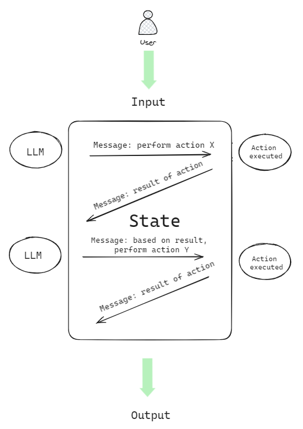

#LLM

[LangChain](https://www.langchain.com/) is an open-source framework designed to simplify the creation of applications that use large language models (LLMs). LangChain has a vibrant community of developers and contributors and is used by many companies and organizations. LangChain utilizes proven Prompt Engineering patterns and techniques to optimize LLMs, ensuring successful and accurate results through verified and tested best practices.

Part of the appeal of LangChain syntax is the capability of breaking down large complex interactions with LLMs into smaller, more manageable steps by composing a reusable [chain](https://python.langchain.com/docs/modules/chains/) process. LangChain provides a syntax for chains([LCEL](https://python.langchain.com/docs/modules/chains/#lcel)), the ability to integrate with external systems through [tools](https://python.langchain.com/docs/integrations/tools/), and end-to-end [agents](https://python.langchain.com/docs/modules/agents/) for common applications.

The concept of an agent is quite similar to that of a chain in LangChain but with one fundamental difference. A chain in LangChain is a hard-coded sequence of steps executed in a specific order. Conversely, an agent leverages the LLM to assess the incoming request with the current context to decide what steps or actions need to be executed and in what order.

LangChain agents can leverage tools and toolkits. A tool can be an integration into an external system, custom code, or even another chain. A toolkit is a collection of tools that can be used to solve a specific problem.

## LangChain RAG pattern

the RAG pattern is implemented as part of a chain that combines a retriever and a Large Language Model (generator). The retriever is responsible for finding the most relevant documents for a given query, in this case, doing a vector search on vCore-based Azure Cosmos DB for MongoDB, and the LLM (generator) is responsible for reasoning over the incoming prompt and context.

### Vector search with LangChain  
  
In the previous lab, the `pymongo` library was used to perform a vector search through a db command to find product documents that were most similar to the user's input. In this lab, you will use the `langchain` library to perform the same search. LangChain has a vector store class named **AzureCosmosDBVectorSearch**, a community contribution, that supports vector search in vCore-based Azure Cosmos DB for MongoDB.  
  
When establishing the connection to the vector store (vCore-based Azure Cosmos DB for MongoDB), recall that in previous labs the products collection was populated and a contentVector field added that contains the vectorized embeddings of the document itself. Finally, a vector index was also created on the contentVector field to enable vector search. The vector index in each collection is named `VectorSearchIndex`.  
  
The return value of a vector search in LangChain is a list of `Document` objects. The LangChain `Document` class contains two properties: `page_content`, that represents the textual content that is typically used to augment the prompt, and `metadata` that contains all other attributes of the document. In the cell below, we'll use the `_id` field as the page_content, and the rest of the fields are returned as metadata.  
  
The next two cells initiate a connection to the vector store and performs a vector search. Notice how much more concise the code is compared to the previous lab with the addition of LangChain.

## RAG with LangChain

#### Chains

Chains refer to sequences of calls - whether to an LLM, a tool, or a data preprocessing step. The primary supported way to do this is with [LCEL](https://python.langchain.com/v0.1/docs/expression_language/).

LCEL is great for constructing your chains, but it's also nice to have chains used off the shelf. There are two types of off-the-shelf chains that LangChain supports:

- Chains that are built with LCEL. In this case, LangChain offers a higher-level constructor method. However, all that is being done under the hood is constructing a chain with LCEL.
- [Legacy] Chains constructed by subclassing from a legacy `Chain` class. These chains do not use LCEL under the hood but are the standalone classes.

We are working on creating methods that create LCEL versions of all chains. We are doing this for a few reasons.

1. Chains constructed in this way are nice because if you want to modify the internals of a chain you can simply modify the LCEL.
2. These chains natively support streaming, async, and batch out of the box.
3. These chains automatically get observability at each step.

This page contains two lists. First, a list of all LCEL chain constructors. Second, a list of all legacy Chains.

## Agents

The core idea of agents is to use a language model to choose a sequence of actions to take. In chains, a sequence of actions is hardcoded (in code). In agents, a language model is used as a reasoning engine to determine which actions to take and in which order.

# LangGraph 

https://langchain-ai.github.io/langgraph/concepts/#data-flow-of-a-single-execution-of-a-stategraph

https://github.com/langchain-ai/langgraph/tree/main/examples

Nodes
States 
Edges
