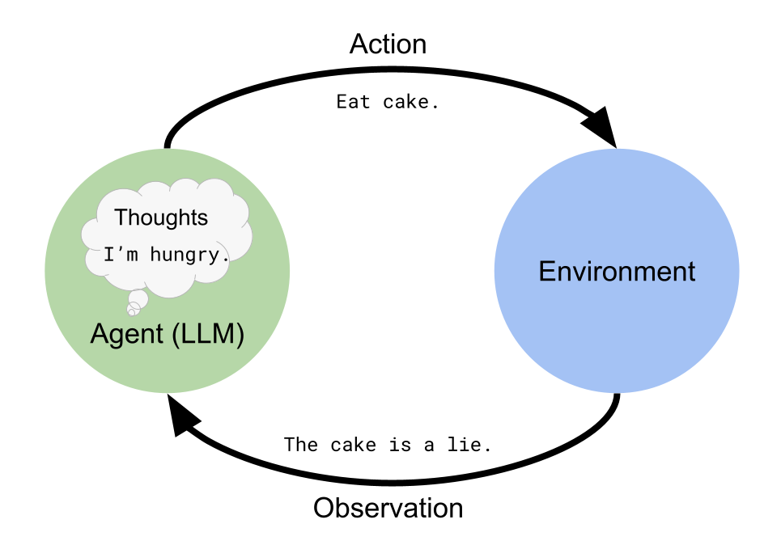

#GenAI #LLM 
## ReAct prompt Engineering

[(1) Lance Martin auf X: „RAG From Scratch Here's a set of short (5-10 min videos) and notebooks explaining > a dozen of my favorite RAG papers. Took a stab at implementing each idea myself (all code open source) and grouped according to the diagram. Repo: https://t.co/n2G5nT83vg Video playlist: https://t.co/iknVUPGuh2“ / X](https://x.com/RLanceMartin/status/1776301631652741167)

# LangGraph 

https://langchain-ai.github.io/langgraph/concepts/#data-flow-of-a-single-execution-of-a-stategraph

https://github.com/langchain-ai/langgraph/tree/main/examples

Nodes
States 
Edges

## Agentic search 
