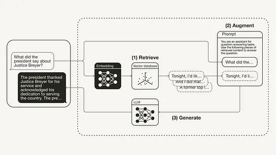

#GenAI #LLM #RAG
## ReAct prompt Engineering

[(1) Lance Martin auf X: „RAG From Scratch Here's a set of short (5-10 min videos) and notebooks explaining > a dozen of my favorite RAG papers. Took a stab at implementing each idea myself (all code open source) and grouped according to the diagram. Repo: https://t.co/n2G5nT83vg Video playlist: https://t.co/iknVUPGuh2“ / X](https://x.com/RLanceMartin/status/1776301631652741167)

# Retrieval-Augmented Generation (RAG)

https://x.com/helloiamleonie/status/1828374047350006017

1. Understand that RAG is just a subset of building LLM-powered apps. RAG just describes explicitly that you are using an external knowledge source. Any resource you find on building LLM-powered apps could be applicable to RAG as well.

2. Understand the motivation behind RAG When LLMs don’t know something, they tend to make things up (instead of admitting they don’t know). That’s called hallucinating.
RAG was intended to reduce hallucinations. The idea is to give the LLM the required info from an external knowledge source. Think of RAG as an open-book exam.

3. Understand the basics of RAG with a practical example. Pick a programming language. Pick a framework (or don’t). And then walk through a minimal RAG example. This is the “Hello world” of AI engineering.

4. Get an overview of advanced RAG techniques The standard (or naive) RAG setting has its limitations. There are various techniques to improve the performance of your RAG system. They can be categorized into: • pre-retrieval • retrieval • post-retrieval

5. Learn how to evaluate a RAG system Evaluating RAG systems is tricky. You need to consider evaluating it: • component-wise (retrieval and generation) • end-to-end

6. Start exploring and evaluating different advanced RAG techniques Once you have an evaluation pipeline set up, you can identify where your system needs to improve and then explore different techniques.

## Agentic search 
