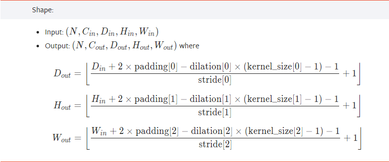

#DNN #deeplearning 

## Convolution Layer 

## Pooling Layer

## Padding Layer

# Initializing neural nets 
#

[Initializing neural networks - deeplearning.ai](https://www.deeplearning.ai/ai-notes/initialization/index.html?utm_campaign=sm%20content%20posts&utm_content=300183222&utm_medium=social&utm_source=twitter&hss_channel=tw-992153930095251456)