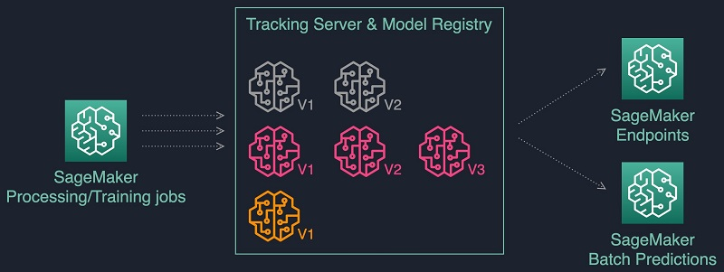

#datascience #monitoring

## Intro 

**MLflow** is an open-source platform to manage the ML lifecycle, including experimentation, reproducibility, deployment, and a central model registry. It includes the following components:

-   **Tracking** – Record and query experiments: code, data, configuration, and results
-   **Projects** – Package data science code in a format to reproduce runs on any platform
-   **Models** – Deploy ML models in diverse serving environments
-   **Registry** – Store, annotate, discover, and manage models in a central repository

MLflow tracking is based on two concepts, _experiments_ and _runs_:

-   An MLflow _experiment_ is the primary unit of organization and access control for MLflow runs; all MLflow runs belong to an experiment. Experiments let you visualize, search for, and compare runs, as well as download run artifacts and metadata for analysis in other tools.
-   An MLflow _run_ corresponds to a single execution of model code. Each run records the following information:
    -   **Source**: Name of the notebook that launched the run or the project name and entry point for the run.
    -   **Version**: Notebook revision if run from a notebook in a Databricks workspace, or Git commit hash if run from [Databricks Repos](https://learn.microsoft.com/en-us/azure/databricks/repos/) or from an [MLflow Project](https://learn.microsoft.com/en-us/azure/databricks/mlflow/projects#mlflow-projects).
    -   **Start & end time**: Start and end time of the run.
    -   **Parameters**: Model parameters saved as key-value pairs. Both keys and values are strings.
    -   **Metrics**: Model evaluation metrics saved as key-value pairs. The value is numeric. Each metric can be updated throughout the course of the run (for example, to track how your model’s loss function is converging), and MLflow records and lets you visualize the metric’s history.
    -   **Tags**: Run metadata saved as key-value pairs. You can update tags during and after a run completes. Both keys and values are strings.
    -   **Artifacts**: Output files in any format. For example, you can record images, models (for example, a pickled scikit-learn model), and data files (for example, a Parquet file) as an artifact.

## Setup tracking server in aws s3 : 
## Steps : 

*[Scenario 4: MLflow with remote Tracking Server, backend and artifact stores](https://mlflow.org/docs/latest/tracking.html#id35)

### [Logging Functions](https://mlflow.org/docs/latest/tracking.html#id63)

[`mlflow.set_tracking_uri()`](https://mlflow.org/docs/latest/python_api/mlflow.html#mlflow.set_tracking_uri "mlflow.set_tracking_uri") connects to a tracking URI. You can also set the `MLFLOW_TRACKING_URI` environment variable to have MLflow find a URI from there. In both cases, the URI can either be a HTTP/HTTPS URI for a remote server, a database connection string, or a local path to log data to a directory. The URI defaults to `mlruns`.

[`mlflow.get_tracking_uri()`](https://mlflow.org/docs/latest/python_api/mlflow.html#mlflow.get_tracking_uri "mlflow.get_tracking_uri") returns the current tracking URI.

[`mlflow.create_experiment()`](https://mlflow.org/docs/latest/python_api/mlflow.html#mlflow.create_experiment "mlflow.create_experiment") creates a new experiment and returns its ID. Runs can be launched under the experiment by passing the experiment ID to `mlflow.start_run`.

[`mlflow.set_experiment()`](https://mlflow.org/docs/latest/python_api/mlflow.html#mlflow.set_experiment "mlflow.set_experiment") sets an experiment as active. If the experiment does not exist, creates a new experiment. If you do not specify an experiment in [`mlflow.start_run()`](https://mlflow.org/docs/latest/python_api/mlflow.html#mlflow.start_run "mlflow.start_run"), new runs are launched under this experiment.

[`mlflow.start_run()`](https://mlflow.org/docs/latest/python_api/mlflow.html#mlflow.start_run "mlflow.start_run") returns the currently active run (if one exists), or starts a new run and returns a [`mlflow.ActiveRun`](https://mlflow.org/docs/latest/python_api/mlflow.html#mlflow.ActiveRun "mlflow.ActiveRun") object usable as a context manager for the current run. You do not need to call `start_run` explicitly: calling one of the logging functions with no active run automatically starts a new one.

## Resources 

[ref](https://aws.amazon.com/blogs/machine-learning/managing-your-machine-learning-lifecycle-with-mlflow-and-amazon-sagemaker/)
https://docs.databricks.com/_static/notebooks/mlflow/mlflow-quick-start-training.html